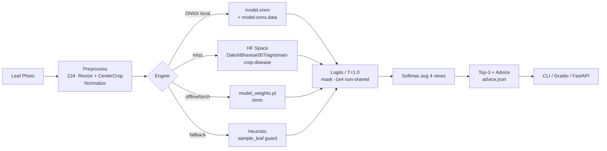
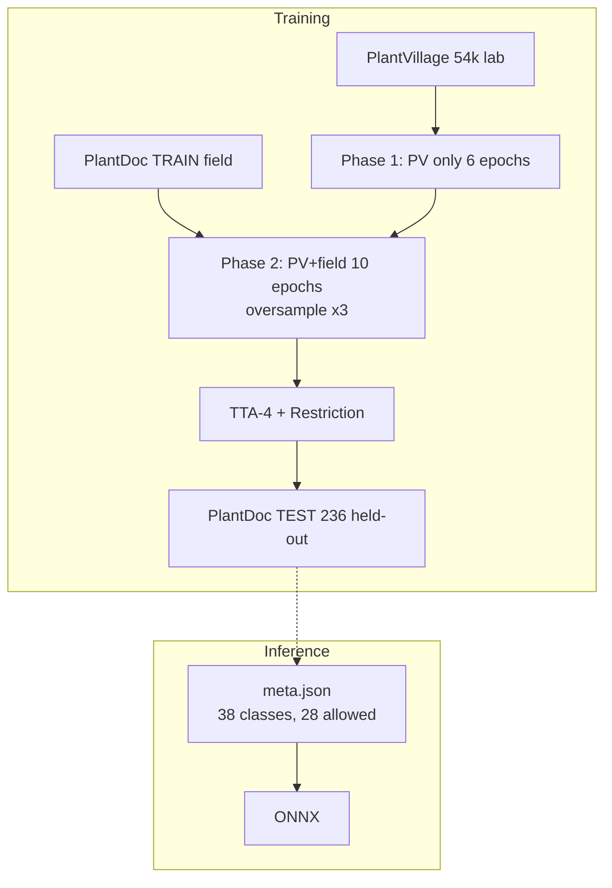

# AgriSmart AI

### Intelligent crop-disease detection — built for the field, not just the lab

[](https://github.com/yuvrajgitacc/agrismart)
[](https://github.com/yuvrajgitacc/agrismart/tree/dev/malay)
[](https://www.python.org)
[](https://onnxruntime.ai)
[](https://huggingface.co/spaces/DakshBhavsar007/agrismart-crop-disease)
[](LICENSE)

Farmers don't photograph leaves in a lab. They photograph them in dust, glare, shadow and wind. AgriSmart is a crop-disease detector designed for that reality - trained on clean lab images and tested on real field photos.

> **SIH 2026 — Problem Statement 1**
---

## What it does

**Core — Crop Disease Detection**
- 38 PlantVillage classes (28 shared with PlantDoc field data) — e.g. `Tomato___Early_blight`, `Potato___Late_blight`, plus healthy.
- Backbone `convnext_small.fb_in22k_ft_in1k` (timm), 2-phase training: PlantVillage pre-train → PlantVillage + PlantDoc field fine-tune (field oversampled ×3).
- Field-photography augmentation at 75%: shadow, blur, noise, JPEG, white-balance, low-res — so the model survives phone photos.
- 4-view TTA + shared-class restriction. Reported on **held-out PlantDoc TEST (236 images, 27 classes)**.

**Performance Metrics**

| Split | Macro-F1 | Accuracy | Notes |
|---|---:|---:|---|
| **Field TEST** (restricted+TTA) | **0.7412** | 0.7500 | Primary ranking metric · `report/confusion_matrix.png` |
| Field TEST top-3 / ECE | 0.9661 / 0.05 | — | `report/per_class_report.txt` |
| Lab val | 0.9978 | — | Optimistic lab gap — see limitations |
| Selection (field-val) | 0.7975 | — | `model/meta.json` |

Weakest: `Corn Cercospora 0.167 (n=4)`, `Tomato Bacterial Spot 0.308` · Strongest: `Squash Powdery Mildew 1.0`, `Strawberry healthy 1.0`. Full per-class table in `report/per_class_report.txt` and `report/disease_metrics.json`.

---

## How it runs





Weights are **not** committed to GitHub (100 MB limit). They live on HF Space and are fetched once via `huggingface_hub` (cached at `~/.cache/huggingface/hub`). 
---

## Quick start — under 10 minutes

### `uv` (recommended)

```bash
git clone https://github.com/yuvrajgitacc/agrismart -b dev/malay
cd agrismart
uv sync

# core — SIH §4.1 interface, prints bare label
uv run python model/predict.py --image model/sample_leaf.jpg
# → Potato___Late_blight

# more detail
uv run python model/predict.py --image model/sample_leaf.jpg --verbose
uv run python model/predict.py --image model/sample_leaf.jpg --json

# judge CLI (single + batch + offline)
uv run agrismart predict --image model/sample_leaf.jpg --offline
uv run agrismart predict --dir ./images --out predictions.csv

# Gradio — Core + Metrics
uv run python gradio_app/app.py
# → http://localhost:7860

# FastAPI
uv run uvicorn app.app:app --host 0.0.0.0 --port 8000
# → http://localhost:8000/docs
```

### `pip`

```bash
pip install -r requirements.txt
python model/predict.py --image model/sample_leaf.jpg
python gradio_app/app.py
```

> `python -c "from model.predict import predict; print(predict('model/sample_leaf.jpg'))"` also works — same label, same engine.

---

## Using the tools

**Gradio**

- **Detect** — upload a leaf, pick `Top-K` and `restrict`, hit Diagnose → top-3 label/confidence bars + precaution (`advice.json`) + raw JSON. Try the seeded example `model/sample_leaf.jpg → Potato___Late_blight`.
- **Metrics & Report** — field macro-F1, accuracy, top-3, ECE, confusion matrix, per-class table and the one-page `report/model_report.md`. 

**API**

`POST /api/predict` with `file` (image) and optional `crop_hint`. Returns `{plant, disease, confidence, tier, isHealthy, top3, advice}`. Other bonus routes return sensible stubs without keys — see `app/app.py`.

---

## Project structure


```
.
├── app/                # FastAPI minimal — /api/predict + bonus stubs, no DB
│   ├── services/       # advisory + crop recommendation heuristics
│   └── static/index.html
├── model/              # SIH §4.1 predict interface + artifacts
│   ├── predict.py      # ONNX → HF Space → torch → heuristic, TTA-4, predict()
│   ├── classes.py      # synced to meta.json (spaces in labels preserved)
│   ├── meta.json       # 38 classes, 28 allowed, metrics, temp, thresholds
│   ├── advice.json     # 38 precautions (farmer-facing)
│   ├── sample_leaf.jpg # test fixture → Potato___Late_blight
│   └── weights/README.md  # HF download instructions
├── report/             # §7.3 one-page + metrics
│   ├── model_report.md
│   ├── disease_metrics.json
│   ├── confusion_matrix.png
│   ├── confusion_matrix_plain.png
│   └── per_class_report.txt
├── cli/                # judge CLI — typer + rich, standalone
├── gradio_app/         # judge Gradio — Detect + Metrics, themed
├── requirements.txt    # ONNX Runtime minimal (torch optional)
├── pyproject.toml      # uv + `agrismart` console script
└── test_sih_compliance.py  # 5 checks — structure, predict, metrics, bonus, FastAPI
```

---

## Dataset & training notes

- **Sources:** PlantVillage (lab) + PlantDoc TRAIN (field). **PlantDoc TEST 236** is held-out, never trained on. ~54k scale. Citations in `report/model_report.md`.
- **Model:** `convnext_small.fb_in22k_ft_in1k`, AdamW + OneCycle, MixUp/CutMix + EMA, label smooth 0.1, background replacement 0.9.

---

## Hosting & reproducibility

- **HF Space:** https://huggingface.co/spaces/DakshBhavsar007/agrismart-crop-disease — `model_weights.pt` (198 MB)
- **Manual fetch:** `huggingface-cli download DakshBhavsar007/agrismart-crop-disease --repo-type space --local-dir model model.onnx model.onnx.data meta.json advice.json`
---
